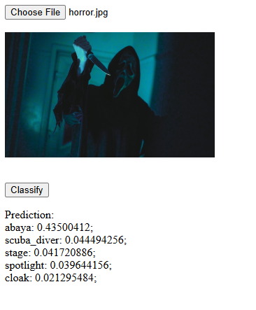

Pretrained model deployment with FastAPI and Docker.

## Project description

Here I use pretrained EfficientNetB0 model from `tensorflow.keras.applications` for image classification. Example of images can be found in `imgs` folder.

  
## How To Run

**app.py** is an entry point of the project

### Run locally
1. Set up a virtual environment:
```
python -m venv .venv
.venv\Scripts\activate 
pip install -r requirements.txt
```
2. Run `uvicorn app:app --port 8080`
3. Open `index.html` in browser
4. Select any image and classify it

Example:



### Run in a Docker container

The only thing you need to run this project in Docker is **Docker Desktop installed on your computer**.

1. Run ***.\deploy.ps1*** in PowerShell
2. Open `index.html` in browser
3. Select any image and classify it

## Additionally

* To create **requirements.txt** file use `pip list --format=freeze > requirements.txt` command to avoid weirdly looking paths
